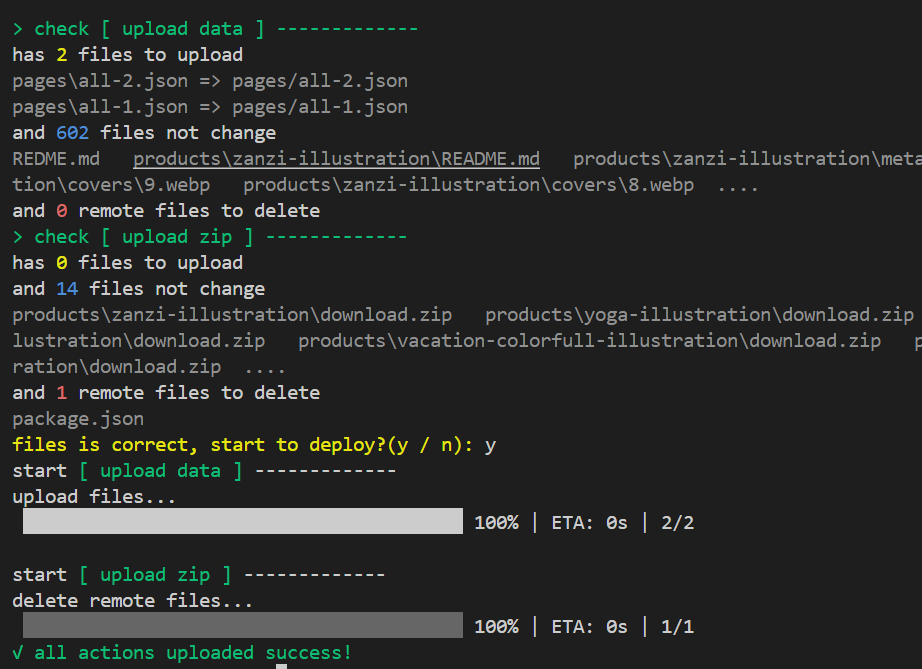

**uplos** is a Node.js command tool for deploy static site to oss(aliyun).

# install

```bash
npm i uplos -g
```

# init

```bash
uplos init
```

this will generate a file named `uplos.config.json`, don't forget to add it to `.gitignore` file.


# deploy

after complete configuration, you can deploy your project

```bash
uplos deploy
```

the result will like following




this demo has two actions(upload some files to one oss and some files to another oss).

before upload, uplos will check the files first, included

- local files shoud be uploaded this time.
- local files shoud be uploaded but has exist on remote and not changed.
- local files has been deleted and should delete remoted files also.


after you confirm, just enter `y` to continue deploy 


# configuration

```js
{
    "actions": [
        {
            "name": "sync data", // action name
            "oss": "aliyun", // now support only aliyun
            "auth": {
                "accessKeyId": "xxx",
                "accessKeySecret": "xxx",
                "bucket":"xxx",
                "region":"xxx"
            },
            "local": "./", // local folder
            "remote": "./", // remote folder
            "remove_prefix": "", // prefix should remove at remote
            "ignore": ["node_modules"],
            "whitelist": [],
            "meta": { // optional, add custom headers for specific files
                "index.html": {
                    "Cache-Control": "no-cache"
                },
                "*.html": {
                    "Cache-Control": "no-cache"
                },
                "**/*.js": {
                    "Cache-Control": "max-age=31536000"
                }
            }
        }
    ] 
}
```


## local and remote path

`local` and `remote` can determine the root folder. for example the following local file structure

```
src
    - main.js
dist
    - index.html
```
default config

```json
{
    "local": "./", 
    "remote": "./"
}
```

will lead `[local => remote]`

```
src/main.js => src/main.js
dist/index.html  =>  dist/index.html
```

but if you change your config like following


```json
{
    "local": "./dist", 
    "remote": "./"
}
```

the result will be

```
dist/index.html  =>  dist/index.html
```

because we just want deplot `./dist` folder, not include `src` folder.

if the oss have muilt usecase, you should deploy this project to remote `web` folder, you can change the config like this

```json
{
    "local": "./dist", 
    "remote": "./web"
}
```

will lead

```
dist/index.html  =>  web/dist/index.html
```

It seems a bit off. The result we need is `web/index.html`, not `web/dist/index.html`. By defualt, local folder will upload into remote folder directly, if you want to remove the prefix, you can add `remove_prefix`

```json
{
    "local": "./dist", 
    "remote": "./web",
    "remove_prefix": "dist"
}
```

then you can ge

```
dist/index.html  =>  web/index.html
```

## ignore and whitelist

perhaps you have the project following

```
package.json
src
    - main.js
product
    - a
        - README.md
        - download.zip
    - b
        - README.md
        - download.zip
    - c
        - README.md
        - download.zip
```

all files will be uploaded default. if you want to ingore some files, for example `package.json`, you can add it to `ignore` field

```json
{
    "ignore": ["package.json"]
}
```

Let's look at another complex scenario, you need upload only all `download.zip` files, Using `ignore` to achieve this would be quite strenuous, now you can use `whitelist`


```json
{
    "whitelist": ["download.zip"]
}
```
will include all download.zip files

```
product/a/download.zip
product/b/download.zip
product/c/download.zip
```

now, I want exclude `product/b/download.zip`, then you can add `ignore`

```json
{
    "whitelist": ["download.zip"],
    "ignore": ["product/b/download.zip"]
}
```

so, `ignore` can work with `whitelist` together, the value is a array, and the grammar is like your `.gitignore`, so the following is also work

```json
{
    "whitelist": ["**/download.zip"],
    "ignore": ["b/download.zip"]
}
```

## meta headers

you can add custom HTTP headers for specific files uploaded to OSS. This is useful for setting cache control, content type, and other HTTP headers.

The `meta` field in the configuration accepts an object where:
- **Key**: A file path pattern (supports glob patterns like `.gitignore`)
- **Value**: An object containing HTTP headers to be set

```json
{
    "meta": {
        "index.html": {
            "Cache-Control": "no-cache"
        },
        "*.html": {
            "Cache-Control": "no-cache"
        },
        "**/*.js": {
            "Cache-Control": "max-age=31536000"
        },
        "**/*.css": {
            "Cache-Control": "max-age=31536000",
            "Content-Type": "text/css"
        }
    }
}
```

**Pattern matching rules:**
- Exact file name: `index.html` matches only `index.html`
- Wildcard: `*.html` matches all `.html` files in any directory
- Glob pattern: `**/*.js` matches all `.js` files in any nested directory
- If multiple patterns match a file, all headers will be merged